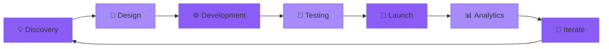

<!-- NEOFETCH-CARD:START -->
<div align="center">
  <a href="https://github.com/real-dhruv">
    
  </a>
</div>

<details>
<summary><code>dhruv@github ~ % neofetch</code> (plain-text version)</summary>

```text
                            ;;;mm;
                       ;8&&&&@&&&@@&&&88;
                    m8&&&&&&&@@@@@@@@@@@&&8
                ;m88&&&88&&@@@@@@@@@@@@@@@@@@8
             ;m8&&&&&&&&@@@@@@@@@@@@@@@@@@@@@&8
             &@@@@@@@@@@@@@@@@@@@@@@@@@@@@@@@@@8
            m@@@@@@@&88mmmmm8&@@@@@@@@@@@@@@@@@@
            &@@@@@&m          ;8&@@@@@@@@@@@@@@@m
            ;&&&@&m             ;;mm8mm8&@@@@@@@8
             ;88m                       8&&@@@@@8
              m     ;;;           ;mm88   ;m&@@@;
             ;;    ;8&@@&8;; ;mm8&&&&8m;;   ;&&&
               /  ;8m&&&&8;;;;;m&&&&&8&m    m&&8
            ; ;/  ;;;8&88;   ;;;888&&8&8;   ;&m;;8
           ;                      ;;;       ;8m; m
             m;                             mmm8;
                      ;          ;;         m; ;;
                     m;  m888&&8;;;m;;  ;  ;;;
                    ;8&m;;m8m88888&@&m;;;;;;;;
                     8m      ;;;mm888;;;;;m
                 ;;        m88;;   ;;;mmmm;
             ;  88;m;      ;mm;    ;;m888
              ; &/ m8m            ;m8&&mm8
                @/  ;8&888&&&&&&&&&&&8m;&@;
                 8   ;m8&@@@@@@@@&88mm;;@@
                       ;mmm8&&&888mmm; &@
                @@&;    ;mm888888mmm; m@@&m8
             8; &@@&8m;;;;m8&888mm;;;m@@@&m8&&
           ;     88m;                m888   ;;mm
          ;      ;mm;;  ;;;;;       ;m88m   ;mm;
        m8;       ;;m;     ;;       ;;;;   ;m;mm ;;
       88m      m88m;;;            ;;;;  ; ;;m8; ;;;
      888m;;mm88&&&88mmm;       ;;;;;;     ;;88; ;;;m
     88mmmmmmmm88888888888; ;;mm;;;m88     mm8m;;;;mmm
     8mmmmmmm;;mmmm88mmmm8mmmm888888&&8;  m888;;;mmmmm
    8mmmmmmmm;;mmm;mm88m8m88888888888888;;m88m;;mmmmm;;
   mmm8mmmmm8;;;mmmmm8mmmmmmmmmmmmmmmmmmmmm88;;mmmmm;;mm
   m88m8mmmm8m;;mmmmm8;;;;;mmm;mmmm;mmmmmm88m;;mmmm;;mmm
  mm88mmm;mm88m;mmmm8mmmm;;mm;;mmmm;mmmmmm88m;mmmm;;;mmmm

User:      Dhruv Pawar
Languages: TypeScript, Python
Focus:     AI agents, automation
GitHub:    github.com/real-dhruv

GitHub Stats ----------------------------
Repos: 22 | Followers: 1 | Commits: 228

```

</details>
<!-- NEOFETCH-CARD:END -->

<div align="center">
  
  <!-- Animated Header with Name -->
  

  <!-- Animated Name Badge -->
  <h1>
    
  </h1>

  <!-- Animated Subtitle -->
  

  <br/>

  <!-- 3D Animated Divider -->
  

  <!-- Connect Section with Better Styling -->
  <br/>
  
  
  
  <b style="font-size: 20px;">LET'S CONNECT</b>
  
  
  
  <br/><br/>
  
  <a href="https://linkedin.com/in/dhruv-pawar17" target="_blank">
    
  </a>
  <a href="mailto:dupawar2004@gmail.com">
    
  </a>
  <a href="https://github.com/DHRUV1817">
    
  </a>
  <a href="https://github.com/DHRUV1817/-Advanced-AI-Reasoning-System-Pro">
    
  </a>

  <br/><br/>
  
  
  
  
  <br/><br/>

</div>

<!-- Animated Wave Divider -->


<br/>

<h2 align="center">
  
  About Dhruv
  
</h2>

<div align="center">

```javascript
const dhruvPawar = {
    role: "AI Solutions & Gen-AI Engineer",
    location: "India 🇮🇳",
    
    whatIDo: {
        design: "End-to-end AI product solutions",
        build: "Production-ready ML systems & LLM applications",
        scale: "AI infrastructure & deployment pipelines",
        strategize: "AI roadmaps & technical feasibility"
    },
    
    expertise: {
        ai_ml: ["LLMs", "NLP", "Reinforcement Learning"],
        productSkills: ["User Research", "MVP Development", "A/B Testing", "Metrics Definition"],
        frameworks: ["PyTorch", "TensorFlow", "HuggingFace", "LangChain"],
        cloud: ["AWS SageMaker", "GCP Vertex AI"],
        mlops: ["MLflow", "Weights & Biases", "CI/CD for ML"]
    },
    
    activeProjects: [
        "🧠 Advanced AI Reasoning System Pro",
        "🔄 Multi-Agent Orchestration Framework",
        "📊 Real-time Model Interpretability Dashboard"
    ],
    
    approach: "Turning AI research into market-ready solutions",
    superpower: "Translating complex AI into business value ⚡"
};
```

</div>

<br/>


<br/>

<h2 align="center">
  
  Current Mission
</h2>

<div align="center">
  <table>
    <tr>
      <td align="center" width="25%">
        <br/>
        <b>🎯 Ideating</b><br/>
        <sub>AI Product Concepts<br/>& Market Fit Analysis</sub>
      </td>
      <td align="center" width="25%">
        <br/>
        <b>🚀 Building</b><br/>
        <sub>AI Reasoning Systems<br/>with Multi-Agent Orchestration</sub>
      </td>
      <td align="center" width="25%">
        <br/>
        <b>🔬 Optimizing</b><br/>
        <sub>Model Performance<br/>& User Experience</sub>
      </td>
      <td align="center" width="25%">
        <br/>
        <b>⚡ Scaling</b><br/>
        <sub>LLM Applications<br/>for Production Use</sub>
      </td>
    </tr>
  </table>
</div>

<br/>


<br/>

<h2 align="center">
  
  Product Development Lifecycle
  
</h2>

<div align="center">



<table>
  <tr>
    <td align="center" width="33%">
      <b>📋 Planning & Strategy</b><br/>
      <sub>• Market Research<br/>• User Personas<br/>• Feature Prioritization<br/>• Technical Feasibility</sub>
    </td>
    <td align="center" width="33%">
      <b>🛠️ Build & Deploy</b><br/>
      <sub>• Rapid Prototyping<br/>• ML Model Development<br/>• API & Backend Design<br/>• Cloud Infrastructure</sub>
    </td>
    <td align="center" width="33%">
      <b>📈 Measure & Optimize</b><br/>
      <sub>• KPI Tracking<br/>• A/B Experiments<br/>• Performance Monitoring<br/>• User Feedback Loops</sub>
    </td>
  </tr>
</table>

</div>

<br/>


<br/>

<h2 align="center">
  
  Tech Stack & Tools
  
</h2>

<div align="center">

### 💻 Programming Languages
<br/>

<br/><br/>

### 🤖 AI & Machine Learning
<br/>

<br/><br/>


### ☁️ Cloud & MLOps
<br/>

<br/><br/>


### 📊 Data Engineering & Analytics
<br/>

<br/><br/>


### 🛠️ Development & Collaboration
<br/>

<br/><br/>

<br/><br/>


</div>

<br/>


<br/>

<h2 align="center">
  
  GitHub Analytics
</h2>

<div align="center">
  
  <!-- Main Stats Row -->
  
  
  
  <br/><br/>
  
  <!-- Languages & Contributions -->
  
  
  
  <br/><br/>
  
  <!-- Activity Graph -->
  
  
  <br/><br/>
  
  <!-- Detailed Stats -->
  

</div>

<br/>


<br/>

<h2 align="center">
  🏆 GitHub Trophies & Achievements
</h2>

<div align="center">
  
</div>

<br/>


<br/>

<h2 align="center">
  
  Featured Projects
  
</h2>

<div align="center">
  <a href="https://github.com/DHRUV1817/-Advanced-AI-Reasoning-System-Pro">
    
  </a>
</div>

<br/>

<!-- Contribution Snake -->
<picture>
  <source media="(prefers-color-scheme: dark)" srcset="https://raw.githubusercontent.com/dhruv1817/dhruv1817/output/github-contribution-grid-snake-dark.svg">
  <source media="(prefers-color-scheme: light)" srcset="https://raw.githubusercontent.com/dhruv1817/dhruv1817/output/github-contribution-grid-snake.svg">
  
</picture>

<br/><br/>


<br/>

<h2 align="center">💭 Quote of the Day</h2>

<div align="center">
  
</div>

<br/>


<br/>

<div align="center">
  
  <!-- Support Section -->
  <h3>
    
    Support My Work
  </h3>
  
  <p>If you find my work valuable, consider supporting me!</p>
  
  <a href="https://www.buymeacoffee.com/dhruvpawar" target="_blank">
    
  </a>
  
  <br/><br/>
  
  
  
  <br/>
  
  <!-- Footer -->
  
  
  <br/>
  
   
  
  
  <h3>Thanks for visiting! Let's connect and build the future of AI together 🚀</h3>
  
  
  
  
  <br/><br/>
  
  <i>"Building Gen-AI Solutions, one commit at a time."</i> 
  
  <br/>
  
  
  
  <br/><br/>
  
  
  
  <br/>
  
  <sub>⭐ From <a href="https://github.com/DHRUV1817">Dhruv Pawar</a> | Made with 💜 and lots of ☕</sub>
  
  <br/><br/>
  
  <!-- Footer Badges -->
  
  
  
  
</div>
